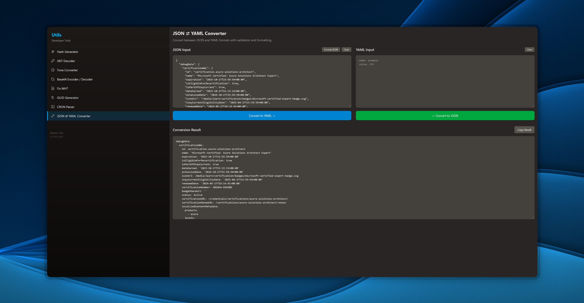

# 🛠️ Utils

"Utils" is a web-based utility server that provides small mundane task solutions. The project hosts various developer tools accessible both through a
modern web UI, RESTful API endpoints and MCP endpoints, making it perfect for quick tasks, automation, and integration into other workflows.

## 📖 Table of contents

- [🚀 Getting started](#-getting-started)
- [🧰 Available Tools](#-available-tools)
- [🌐 Web Interface](#-web-interface)
- [📡 API Endpoints](#-api-endpoints)
- [🤖 Model Context Protocol (MCP) Support](#-model-context-protocol-mcp-support)
- [🧪 Testing](#-testing)
- [⚙️ Configuration](#️-configuration)
- [📓 Future Plans](#-future-plans)

## 🚀 Getting started

Node.js is required to run this project. You can find [Node.js installation instructions](https://nodejs.org/) for your platform.

1. Clone the repository and navigate to the project directory
2. Install dependencies:

   ```bash
   npm install
   ```

3. (Optional) Create a `.env` file at the root of the project directory for custom configuration. See [⚙️ Configuration](#️-configuration).
4. Start the server:

   ```bash
   npm start
   ```

5. Open your browser and navigate to `http://localhost:5000` to access the web interface

The server will start on port 5000 by default and provide both the web interface, API and MCP endpoints.

## 🧰 Available Tools

### Hash Generator

- ✅ **MD5** - Generate MD5 hashes
- ✅ **SHA1** - Generate SHA1 hashes
- ✅ **SHA256** - Generate SHA256 hashes
- ✅ **SHA512** - Generate SHA512 hashes

### JWT Decoder

- ✅ **JWT Token Decoding** - Decode JWT tokens to view header and payload
- ✅ **Token Information Display** - Shows algorithm, issued at, expires at times

### Time Converter

- ✅ **Timestamp Conversion** - Convert between various time formats
- ✅ **Multiple Format Support** - Unix timestamps, ISO strings, and more
- ✅ **Relative Time Display** - Shows human-readable relative time

### GUID Generator

- ✅ **UUID Generation** - Generate UUIDs/GUIDs
- ✅ **Batch Generation** - Generate multiple GUIDs at once
- ✅ **Customizable Count** - Specify the number of GUIDs to generate

### CRON Expression Parser

- ✅ **CRON Description** - Convert CRON expressions to human-readable descriptions

### JSON ⇄ YAML Converter

- ✅ **Bidirectional Conversion** - Convert between JSON and YAML formats
- ✅ **Pretty Formatting** - Well-formatted output

### MHT File Fixer

- ✅ **MHT File Processing** - Fix corrupted MHT files
- ✅ **Base64 Image Extraction** - Extract and display embedded images
- ✅ **Image Download** - Download extracted images individually

## 🌐 Web Interface

Access the web interface at `http://localhost:5000` when the server is running.



## 📡 API Endpoints

All API endpoints return JSON responses.

### Core Endpoints

- `GET /api/ping` - Health check endpoint
- `POST /api/generator/hash` - Generate hashes for provided text
- `GET /api/generator/guid/:count?` - Generate GUIDs (default: 10)
- `POST /api/jwt/decode` - Decode JWT tokens
- `POST /api/time/convert` - Convert time formats
- `POST /api/cron/describe` - Parse CRON expressions
- `POST /api/serialize/json/yml` - Convert JSON to YAML
- `POST /api/serialize/yml/json` - Convert YAML to JSON
- `POST /api/mht` - Process MHT files

### Example API Usage

```javascript
// Generate hashes
fetch('/api/generator/hash', {
    method: 'POST',
    headers: { 'Content-Type': 'application/json' },
    body: JSON.stringify({ text: 'Hello, World!' })
});

// Decode JWT
fetch('/api/jwt/decode', {
    method: 'POST',
    headers: { 'Content-Type': 'application/json' },
    body: JSON.stringify({ token: 'your.jwt.token' })
});

// Generate 5 GUIDs
fetch('/api/generator/guid/5');
```

TODO: add full api reference doc

## 🤖 Model Context Protocol (MCP) Support

The project includes MCP server support for integration with AI tools and assistants:

- **Stateless HTTP Transport** - Each request creates isolated server instances
- **Tool Registration** - Exposes utility functions as MCP tools
- **Concurrent Client Support** - Handles multiple clients without ID collisions

Almost all tolls are available as MCP tools. Access MCP endpoints via `POST /mcp`.

TODO: add full mcp reference doc

## 🧪 Testing

The project includes testing with multiple test suites:

```bash
# Run unit tests
npm run test:unit

# Run API tests
npm run test:api

# Run integration tests
cd integration && npm run test:integration
```

Testing stack:

- **Jest** - Test framework
- **Supertest** - API testing
- **Playwright** - Integration testing
- **Cross-env** - Environment variable management

## ⚙️ Configuration

### Environment Variables

- `VERSION` - Application version (default: "1.0.0")
- `NODE_ENV` - Environment mode (development/test/production)
- `PORT` - Server port (default: 5000)

### Logging

The application uses Winston for logging with:

- **File rotation** - Automatic log file rotation (per run)
- **Environment-specific loggers** - Different configurations per environment
- **HTTP request logging** - Via Morgan middleware

## 📓 Future Plans

- [ ] Support for additional serialization formats (XML, etc?)
- [ ] URL encoding/decoding utilities
- [ ] Password generator with customizable rules
- [ ] Dockerize app

---

**Author**: christking246  
**License**: MIT  
**Version**: 1.0.0
